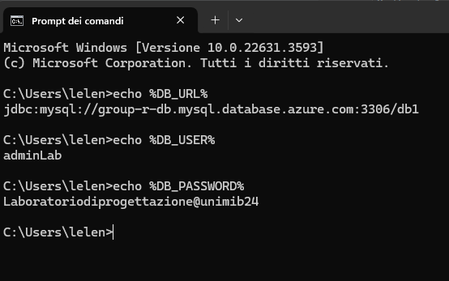

## Accesso e gestione del database mySQL su AZURE
In questa sezione del manuale tecnico viene fornita una guida completa per l'accesso e la gestione del database MySQL utilizzato per memorizzare i dati dell'applicazione.\
Il database è ospitato tramite i servizi cloud offerti da Microsoft Azure, garantendo affidabilità, scalabilità e sicurezza per la persistenza dei dati dell'applicazione.\
Nel seguito del manuale, verranno fornite istruzioni dettagliate su come accedere ai servizi cloud di Azure, creare e configurare una macchina virtuale per ospitare il database MySQL e le relative informazioni per effettuare una connessione con il database.

### Creazione del database mySQL
Una volta effettuato l’accesso con il proprio account Azure, viene visualizzata la home page.\
\
Ricercare nella barra di ricerca “Database di Azure per i server MySQL” e proseguire\
\
Visualizzata la nuova schermata, premere su “CREA” per iniziare la configurazione della nuova risorsa.\
Selezionare la versione del servizio “Server Flessibile” e proseguire nelle schermate successive inserendo i dettagli sulla creazione del database in base alle proprie esigenze e proseguire con la creazione della risorsa. Una volta conclusa la creazione del database, quest’ultimo viene visualizzato come mostrato di seguito:\
\
Premendo sul nome della risorsa appena creata è possibile accedere alla panoramica e tutte le sue impostazioni\
\
è bene notare che non appena creata la risorsa relativa al Database, esso verrà eseguito automaticamente. Se si desidera arrestare il servizio dopo averlo creato seguire la sezione “Avvio e Arresto del Database MySQL”.

### Avvio e Arresto del Database MySQL
Una volta creato, per avviare e arrestare l’esecuzione del database MySQL mediante i servizi cloud di Azure è possibile seguire i seguenti passaggi:

Avvio del database:
1.	Accedere al portale di Azure con le proprie credenziali
2.	Digitare nella barra di ricerca “Database di Azure per i server MySQL”
3.	Selezionare la risorsa che ospita il database MySQL
4.	Nella sezione “Panoramica”, fare clic su “Avvia” per avviare il database
5.	Una volta avviato il tutto, il database MySQL verrà eseguito e sarà disponibile per essere utilizzato

Arresto del Database:
1.	Accedere al portale di Azure con le proprie credenziali
2.	Digitare nella barra di ricerca “Database di Azure per i server MySQL”
3.	Selezionare la risorsa che ospita il database MySQL
4.	Nella sezione “Panoramica”, fare clic su “Arresta” per arrestare il database
5.	Una volta arrestato il tutto, il database MySQL non sarà più eseguito e non sarà disponibile per essere utilizzato

### Credenziali di accesso
Le credenziali di accesso al database MySQL su Microsoft Azure sono fondamentali per stabilire una connessione sicura e autorizzata al database stesso.\
Di seguito sono riportati i passaggi per ottenere le credenziali di accesso al database:
1.	Accedere al portale di Azure con le proprie credenziali
2.	Digitare nella barra di ricerca “Database di Azure per i server MySQL”
3.	Selezionare la risorsa che ospita il database MySQL
4.	Nella sezione “Connetti” è possibile visualizzare le credenziali per effettuare una connessione al database.

Tramite la sezione “Dettagli Connessione è possibile visualizzare le seguenti informazioni:\
\
Per quanto riguarda la password, per questioni di sicurezza, è stata comunicata tramite canali sicuri al momento della consegna del progetto, in caso di necessità contattare il team di sviluppo.\
Mediante la sezione “MySQL Workbench” è possibile visualizzare le istruzioni per conettersi al client di MySQL Workbench:\
\
Per effettuare il download del file DigiCertGlobalRootCA.crt.pem. visitare la sezione “rete” del database (nella barra laterale della finestra) e fare clic su “Scarica certificato SSL”, come mostrato di seguito:\
\
Per questioni di sicurezza si ricorda che, è di fondamentale importanza trattare le credenziali con estrema riservatezza e attenersi a pratiche di sicurezza consigliate per garantire la protezione dei dati sensibili e la sicurezza complessiva del sistema.\
Si raccomanda di evitare di memorizzare le credenziali in modo non sicuro o di renderle disponibili a individui non autorizzati.\
Una volta completati questi passaggi, l'applicazione sarà pronta per utilizzare le credenziali per stabilire una connessione al database MySQL su Microsoft Azure e accedere ai dati in modo sicuro e autorizzato.


### Configurazione delle Variabili d'Ambiente su Windows

#### Introduzione
Questa porzione del manuale permette di configurare le variabili d'ambiente necessarie per effettuare una connessione sicura al database MySQL. Configureremo le variabili d'ambiente per l'URL del database, l'username e la password.

#### Passaggi per Configurare le Variabili d'Ambiente

1. **Apertura del Pannello di Controllo**
    - Premi i tasti `Win + S` per aprire la ricerca di Windows.
    - Digita `Pannello di controllo` e premi Invio.
    - Nella finestra del Pannello di Controllo, clicca su `Sistema e sicurezza`.
    - Successivamente, clicca su `Sistema`.

2. **Accesso alle Impostazioni Avanzate di Sistema**
    - Nella finestra Sistema, clicca su `Impostazioni di sistema avanzate` situato sul lato sinistro.

3. **Apertura delle Variabili d'Ambiente**
    - Nella finestra Proprietà del sistema, assicurati di essere nella scheda `Avanzate`.
    - Clicca su `Variabili d'ambiente` nella parte inferiore della finestra.

4. **Aggiunta delle Variabili d'Ambiente**
    - Nella finestra delle Variabili d'ambiente, noterai due sezioni: `Variabili utente` e `Variabili di sistema`. È preferibile aggiungere le variabili come `Variabili di sistema` per assicurarsi che siano accessibili da tutti gli utenti e processi del sistema.

    - Clicca su `Nuova...` sotto la sezione `Variabili di sistema`.

5. **Configurazione delle Variabili**

    - **Aggiunta dell'URL del Database**
        - Nella finestra `Nuova variabile di sistema`, inserisci:
            - **Nome variabile**: `DB_URL`
            - **Valore variabile**: `jdbc:mysql://group-r-db.mysql.database.azure.com:3306/db1`
        - Clicca su `OK`.

    - **Aggiunta dell'Username del Database**
        - Nella finestra `Nuova variabile di sistema`, inserisci:
            - **Nome variabile**: `DB_USER`
            - **Valore variabile**: `adminLab`
        - Clicca su `OK`.

    - **Aggiunta della Password del Database**
        - Nella finestra `Nuova variabile di sistema`, inserisci:
            - **Nome variabile**: `DB_PASSWORD`
            - **Valore variabile**: `Laboratoriodiprogettazione@unimib24`
        - Clicca su `OK`.

6. **Conferma delle Modifiche**
    - Dopo aver aggiunto tutte le variabili, clicca su `OK` nella finestra delle Variabili d'ambiente.
    - Clicca nuovamente su `OK` nella finestra delle Proprietà del sistema.

#### Verifica delle Variabili d'Ambiente

1. **Apertura del Prompt dei Comandi**
    - Premi i tasti `Win + S` per aprire la ricerca di Windows.
    - Digita `cmd` e premi Invio per aprire il Prompt dei comandi.

2. **Verifica delle Variabili**
    - Nel Prompt dei comandi, digita i seguenti comandi per verificare che le variabili siano state configurate correttamente:
      ```shA
      echo %DB_URL%
      echo %DB_USER%
      echo %DB_PASSWORD%
      ```
    - Ogni comando dovrebbe restituire il valore della variabile corrispondente come mostrato nella figura di seguito:
   


### Configurazione delle Variabili d'Ambiente su macOS

#### Introduzione
Questa porzione del manuale permette di configurare le variabili d'ambiente necessarie per effettuare una connessione sicura al database MySQL su macOS. Configureremo le variabili d'ambiente per l'URL del database, l'username e la password.

#### Passaggi per Configurare le Variabili d'Ambiente

1. **Apertura del Terminale**
   - Premi `Cmd + Space` per aprire Spotlight.
   - Digita `Terminale` e premi Invio.

2. **Modifica del File di Configurazione della Shell**
   - Una volta aperto il terminale, dovrai modificare il file di configurazione della shell. Il file da modificare dipende dalla shell che stai utilizzando (`bash` o `zsh`).
   - Per `bash`, apri il file `.bash_profile`:
     ```sh
     nano ~/.bash_profile
     ```
   - Per `zsh`, apri il file `.zshrc`:
     ```sh
     nano ~/.zshrc
     ```

3. **Aggiunta delle Variabili d'Ambiente**
   - Aggiungi le seguenti righe al file di configurazione aperto:
     ```sh
     export DB_URL="jdbc:mysql://group-r-db.mysql.database.azure.com:3306/db1"
     export DB_USER="adminLab"
     export DB_PASSWORD="Laboratoriodiprogettazione@unimib24"
     ```

4. **Salvataggio delle Modifiche**
   - Dopo aver aggiunto le variabili, salva le modifiche:
      - Premi `Ctrl + O` e poi `Invio` per salvare.
      - Premi `Ctrl + X` per uscire dall'editor.

5. **Applicazione delle Modifiche**
   - Per applicare le modifiche, esegui il seguente comando:
      - Per `bash`:
        ```sh
        source ~/.bash_profile
        ```
      - Per `zsh`:
        ```sh
        source ~/.zshrc
        ```

#### Verifica delle Variabili d'Ambiente

1. **Verifica delle Variabili**
   - Nel Terminale, digita i seguenti comandi per verificare che le variabili siano state configurate correttamente:
     ```sh
     echo $DB_URL
     echo $DB_USER
     echo $DB_PASSWORD
     ```
   - Ogni comando dovrebbe restituire il valore della variabile corrispondente.

Ora, le variabili d'ambiente sono configurate correttamente su macOS e il tuo progetto Java può utilizzarle per stabilire una connessione sicura al database MySQL su Microsoft Azure.
